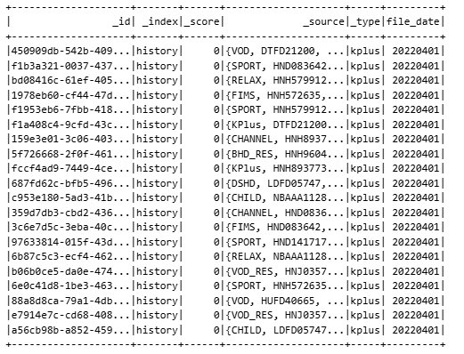
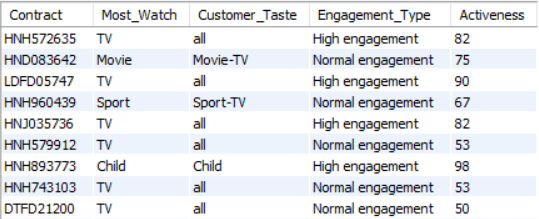
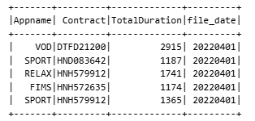
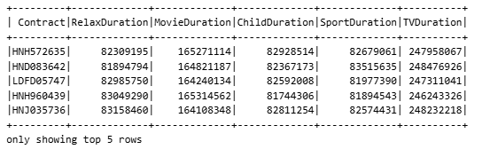
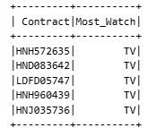
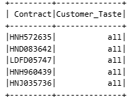
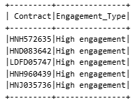
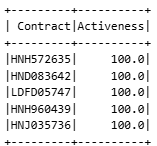

# 📊 Customer Behavior ETL Pipeline

## 📌 Giới thiệu
Dự án xây dựng **pipeline ETL bằng Apache Spark (PySpark)** nhằm thu thập, xử lý và phân tích **hành vi xem nội dung của khách hàng ** từ các file log JSON theo ngày.

🎯 **Giá trị nghiệp vụ**:
- Xác định khách hàng **thích xem nội dung gì nhất**
- Phân tích **nội dung mà khách hàng yêu thích (Customer Taste)**
- Đánh giá **mức độ tương tác (Engagement Type)**
- Đo lường **mức độ hoạt động (Activeness)** theo thời gian  
→ Kết quả phục vụ phân tích, báo cáo và các bài toán recommendation / segmentation.

---

## 🏗️ Kiến trúc tổng thể
**JSON Log Files**  → **PySpark ETL**  → **MySQL**

---

## 📥 Dữ liệu đầu vào
- 📄 Định dạng: **JSON**
- 📆 Tần suất: **1 file / ngày**
- 🏷️ Tên file: `YYYYMMDD.json`

---

## 📤 Dữ liệu đầu ra
Bảng **customer_profile** (MySQL):

| Cột | Ý nghĩa |
|---|---|
| Contract | Mã khách hàng |
| Most_Watch | Nhóm nội dung xem nhiều nhất |
| Customer_Taste | Tổ hợp nhóm nội dung thường xem |
| Engagement_Type | Mức độ engagement |
| Activeness | % số ngày active |

🖼️ **Kết quả bảng output**  

---

## 🔄 ETL Process (Chi tiết từng bước)

### 🔹 Bước 1: Extract – Đọc dữ liệu log
- Đọc các file JSON và chọn các trường cần thiết

🖼️  

---

### 🔹 Bước 2: Pivot table tính tổng thời lượng xem của các khách hàng theo thể loại TV Show
- Phân loại ứng dụng thành các nhóm:
  - TV, Movie, Child, Relax, Sport
- Loại bỏ dữ liệu không hợp lệ
- Tổng hợp thời lượng xem theo `Contract` & `Type`
- Pivot dữ liệu về dạng **1 dòng / 1 khách hàng**

🖼️  

---

### 🔹 Bước 3:  Chương trình có thời lượng xem nhiều nhất
- Xác định nhóm nội dung có **thời lượng xem lớn nhất**

🖼️  

---

### 🔹 Bước 4: Khẩu vị xem của khách hàng
- Ghép các nhóm nội dung có thời lượng > 0

🖼️  

---

### 🔹 Bước 5: Mức độ tương tác của khách hàng
- Phân loại mức độ engagement:
  - Low / Normal / High
- Dựa trên tổng thời lượng xem

🖼️  

---

### 🔹 Bước 6: Feature Engineering – Activeness
- Tính số ngày hoạt động tron 1 tháng
- Tính % số ngày khách hàng xuất hiện trong log
- Công thức: Activeness = (Active Days / Total Days) * 100
🖼️  

---
### 🔹 Bước 7: Load – Ghi dữ liệu vào MySQL
- Tạo liên kết và kết nối đến mysql sau đó tạo và ghi dữ liệu vào bảng **customer_profile**
- Phục vụ phân tích và báo cáo

🖼️  

